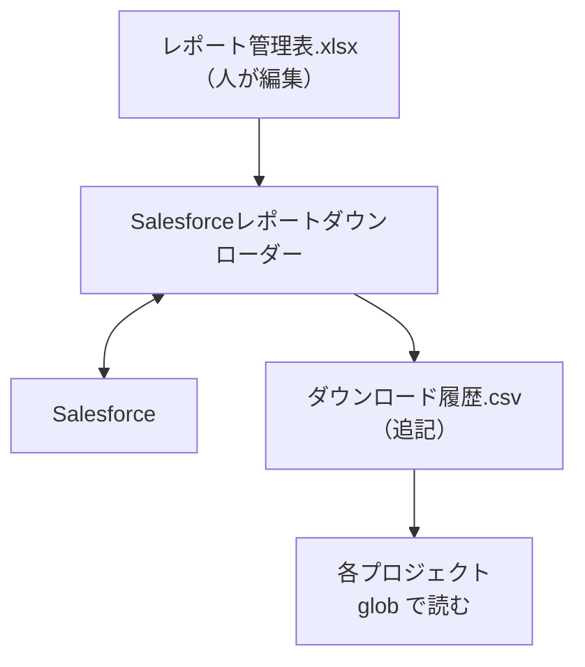
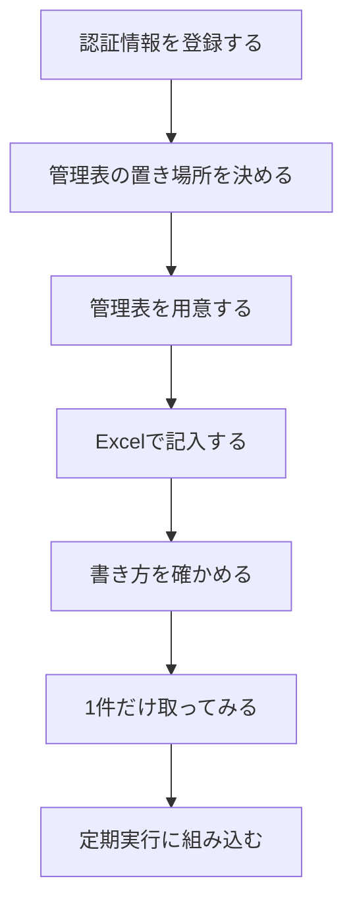

# Salesforce レポートの集約取得（salesforce_downloader）

このリポジトリの `src/` は、`download_scheduled()` を含む
Salesforce レポート集約取得のパッケージを置く。**ここに書いているのは
このリポジトリに置かれている実装と利用方法**（`src.cli check` /
`src.service.download_scheduled()` / `src.soql_reports` /
`src.paths.output_path()`）。comken 側は引き続き `Table` / `CSV` / `Excel` /
`site_for` / `SalesforceBase` / `ComkenError` / `core.discovery` など、
Salesforce レポート取得以外の共通基盤を置いている。

各プロジェクトが個別に Salesforce からレポートを落としていると、**どのプロジェクトが
どのレポートを、どれくらいの頻度で取っているのか**が分からなくなる。取得をここへ集約し、
何を取っているかは**管理表（Excel）**に、いつ何を取ったかは**履歴（CSV）**に集める。

```
レポート管理表.xlsx（人が編集）        ダウンロード履歴.csv（プログラムが追記）
        ↓                                      ↑
  Salesforceレポートダウンローダー       ──→ Salesforce
        ↓
  各プロジェクト（src.paths.output_path() で組み立てたパスを glob）
```

以下は上の構成を Mermaid の `graph TD` で描き直したもの。



---

## 使う側

```python
from datetime import datetime
from pathlib import Path

from src.paths import output_path
from src.sheets.master import load_master

CUSTOMER_LIST = "1001"    # 管理表の「ID」。意味の分かる名前を付ける

# download_scheduled() はスケジュール外から直接呼んで「今すぐ取りに行く」用途にも使える。
# 定期実行は `Salesforceレポートダウンローダー` 側（`src/run.py`）がスケジュール駆動で呼ぶ。
# 既に取ってあるファイルを読み取りたいときは、output_path() で組み立てたパスを glob する:
folder = output_path(load_master()[CUSTOMER_LIST], now=datetime.now()).parent
saved = sorted(folder.glob(f"{CUSTOMER_LIST}_*.csv"))
# `saved` の一番新しい要素が本日の最新キャッシュ
```

**プロジェクトのコードに Salesforce の URL もレポート ID も書かない。** 書くのは管理番号だけ。
参照先の Salesforce レポートを差し替えても、`CUSTOMER_LIST = "1001"` はそのままでよい。

戻り値は `Table`（`comken.core.table.model.Table`）。`index()` / `filter()` /
`replace()` / `append()` など、`Table` の API がそのまま使える。CSV / Excel の
読み込みは中で吸収するので、利用側は中身の形式を意識しなくてよい。
ファイルパスだけ欲しいときは `output_path()` で組み立てたパスを `pathlib.Path.glob()` で拾う形になります。

`output_path()` + `glob()` を使う側が自動的に取りに行かない理由は
**ここで自動的に取りに行くと、定期取得が動いていないことに誰も
気づかなくなる**ため。

### 2つの関数の使い分け

| | 意味 | Salesforce へ問い合わせるか | どこにあるか |
|---|---|---|---|
| `download_scheduled()` | **今この瞬間に、有効な全レポートをまとめて取りに行く** | **行く**（定期取得の入口） | Salesforceレポートダウンローダー |
| `output_path(entry)` + `glob` | **本日の定期取得キャッシュのパスを組み立てる** | **行かない**（無ければ例外） | src |

急いでその場の最新値が必要なときは `download_scheduled()` をスケジュール外で
直接実行する（Salesforceレポートダウンローダー側）。「今すぐ取りに行く」だけの
専用関数はどちらのリポジトリにも置かない（定期取得が動いていないことに誰も
気づかなくなるため）。

定期キャッシュを1日に複数回更新したいときは、呼び出す側のスケジューラから
`download_scheduled()` を必要な時刻に実行する。複雑なスケジュール（土日祝を除く等）を
呼び出す側と二重に持たせない——予定は呼び出す側にすでにあるため。

---

## はじめて使うとき（通しの手順）

**配置した直後に1回だけやる作業。** 順番に意味があるので、上から進める。

下の手順は上から流す一本道。各ステップの見出しをそのままノード名にしている。



### 1. 認証情報を登録する

Salesforce につなげないと、あとの確認が全部できない。**ここが先**。

```bat
python -m comken cred import 認証情報.json
```

登録できたら、つながるかを確かめる（**副作用のないコマンド**）。

```bat
python -m comken sf check
```
（※ 認証情報の接続確認は comken 側のコマンド。手順の詳細は comken の docs を参照）

### 2. 管理表の置き場所を決める

**先に決める。** 場所は `src/paths.py` の
`MASTER_PATH` に書いてあり、**配置のときに書き換えるファイルのひとつ**
（→ [配置するときの設定](#配置するときの設定)）。

### 3. 管理表を用意する

**管理表（Excel）は非エンジニアが手動で用意・編集する。** ライブラリ側は雛形を
自動生成する `init` コマンドを提供していない。雛形が必要な場合は、
`Salesforceレポートダウンローダー` リポジトリ側（`src/template_writer.py`）
の関数（`create_combined_workbook()` など）を Python から直接呼んで作成する
（サンプルは [管理表（master_table）](master-table.md) を参照）。

管理表の1行目（見出し）は次のとおり。各列の意味は「記入方法」シートを用意するなら
そこに書く。

| 列 | 例 |
|---|---|
| ID | `1001` |
| グループ | `営業本部` |
| 担当者 | `山田太郎` |
| 概要 | `顧客一覧` |
| Salesforce URL | `https://.../Report/00O.../view` |
| 有効 | `○` |
| 0件あり | `×` |
| 2000件超 | `×` |
| SOQL | `×` |

**保存先（フォルダ）は管理表に書かない。** 出力先は **「設定」シート**（管理表と同じ
ブック内の別シート）に「グループ→ベースパス」の対応を書き、`グループ` 列から
Python 側で組み立てる（`src.paths.report_folder()`）。**`担当者` / `概要` は
記録用として管理表に残るが、出力パス（フォルダ階層）には影響しない**
（2026-09 に「`ベースパス / 担当者 / 概要 / ファイル`」の3階層組み立てを廃止し、
「`ベースパス / ファイル`」の単一階層に1本化した）。
Excel の数式で組み立てる案は openpyxl が数式セルを信頼できないため採用しなかった。

備考のような**記録用の列は自由に追加してよい**。
comken はこの表を「宣言した列」だけで読むため、余分な列があっても無視される
（→ [列](#列)）。

### 4. Excel で記入する

書き方の要点は次のとおり:

- **`Salesforce URL` は、レポートを開いたときのアドレスをそのまま貼る**（ID を抜き出さない）
- **`ID` は社内で決める管理番号**。Salesforce のレポート ID ではない
- **「グループ」「担当者」「ベースパス」の各フォルダは先に作っておく。** 無いと
  エラーになる（打ち間違いに気づけるよう、**勝手には作らない**）

### 5. 書き方を確かめる

```bat
python -m src.cli check "\\実際のサーバー\share\tools\salesforce\レポート管理表.xlsx"
```

**Salesforce へはつながない。** 記入内容の検査だけなので、何度でも安全に流せる。

### 6. 1件だけ取ってみる／7. 定期実行に組み込む

ここから先（`download_scheduled()` を使った動作確認・定期実行への組み込み）は
`Salesforceレポートダウンローダー` リポジトリの README を参照。いきなり定期実行に
入れず、まず1件で通しを確かめてから、タスクスケジューラや RPA 基盤へ組み込む
という流れは変わらない。

---

## 管理表（Excel）

**設定の正は Excel。** 内部 DB は持たず、初回読み込み後は解決済みパスでキャッシュされる（プロセスが生きている間は同じ管理表を読み直さない）。 管理表の編集を反映するにはプロセスを起動し直す。

### 雛形を作る（任意）

**管理表（Excel）は非エンジニアが手動で用意・編集する。** 雛形の生成は
`Salesforceレポートダウンローダー` リポジトリ側
（`src/template_writer.py`）の関数で行う
（ライブラリ comken 本体には雛形生成の API は置いていない）。**「管理表」
「スケジュール」「設定」の3シートを1つのブックにまとめて生成**したい場合は
`create_combined_workbook(path)` を、1シートだけ生成したい場合は
`create_template(path, ReportEntry)` などを Python から直接呼ぶ
（詳しくは Salesforceレポートダウンローダー側の README / ソースを参照）。

```python
from src.template_writer import create_combined_workbook

create_combined_workbook("レポート管理表.xlsx")
```

記入例2行と、各列の書き方をまとめた**「記入方法」シート**が入った状態で作られる。
雛形から Excel テーブル（=行を足すのが楽になる構造）が作られ、`choices` を宣言した
列には自動でドロップダウン（入力規則）が付く。雛形全体のフォントは Noto Sans JP
（Windows 標準ではないため未導入 PC では Excel が代替フォントで代替表示する。
動作には影響しない）。

### 編集したあとに確かめる

```bat
python -m src.cli check レポート管理表.xlsx
```

```
読めました: レポート管理表.xlsx
  登録 12 件（有効 8 件 / 無効 1 件）
  スケジュール 5 件、設定 3 件

同じ Salesforce レポートを指している管理番号があります:
  00O5g00000FGHIJ: 1002（売上実績）、1005（売上実績・別集計）

有効な管理番号 1 件はスケジュール行が登録されていません
（毎回取得される後方互換の挙動です。意図と合っているか確認してください）:
  1004（未分類レポート）
```

**`check` は 3 シート（管理表 / スケジュール / 設定）を読み込み、相互参照
エラーもまとめて報告する。** 1 件目で止めず、該当をすべて列挙してから
**終了コード 1** で戻る:

- スケジュールの「レポートキー」が管理表の「ID」に無い → 該当のスケジュールキーを列挙
- 管理表で使われているグループが「設定」シートに登録されていない → 該当のグループを列挙

上記の例でいうと、参照している管理番号が無いスケジュールや、未登録のグループが
あった場合は:

```
スケジュールの「レポートキー」が管理表に存在しません: S099（→ 9999）
管理表で使われているグループが「設定」シートに登録されていません: 新規部署

相互参照エラー: 2 件（管理表を開いて直してからもう一度 sfdl check を実行してください）
```

`check` は保守用コマンドであり、業務の定期実行ではない。書き方の誤りは
取得時にも止まるが、編集直後にその場で気づけた方が早い。

### 列

シート名は `管理表`。1行目が見出し。列の宣言は
`src/sheets/master.py` にあり、読み込み・検証・雛形生成の
仕組みは [管理表（master_table）](master-table.md) が持つ。

| ID | グループ | 担当者 | 概要 | Salesforce URL | 有効 | 0件あり | 2000件超 | SOQL |
|---|---|---|---|---|---|---|---|---|
| 1001 | 営業本部 | 山田太郎 | 顧客一覧 | https://.../Report/00O5g00000ABCDE/view | ○ | × | × | × |
| 1002 | 営業本部 | 佐藤花子 | 売上実績 | https://.../Report/00O5g00000FGHIJ/view | ○ | ○ | × | × |

| 列 | 何を書くか |
|---|---|
| **ID** | 社内で決める管理番号（`1001`, `CUST-01` など）。**Salesforce のレポート ID ではない**。前ゼロ（`0001`）や記号入りも使える |
| **グループ** | 出力先の起点となるグループ名。「設定」シート（[設定シート](#設定シート) 参照）に登録したグループ名と一致させる |
| **担当者** | 担当者名。**記録用**。出力パス（フォルダ階層）には使わない |
| **概要** | 人が読んで分かる説明。**記録用**。出力パス（ファイル名・フォルダ階層）には使わない |
| **Salesforce URL** | レポートを開いたときのアドレスを**そのまま貼る** |
| **有効** | `○` か `×`。**雛形ではドロップダウンから選べる**。行は消さない（履歴との対応が残る） |
| **0件あり** | その日のデータが 0 件になることがあるレポートなら `○`。`×` のときに 0 件だとエラーになります（[「0 件の扱い」](#0-件の扱い) 参照） |
| **2000件超** | Report API の2000行上限を超えることが分かっているなら `○`。取得実行側がブラウザ経由（画面のエクスポート機能）に切り替える。「SOQL」列が `○` のときはこの列より優先される |
| **SOQL** | SOQL化済みで、同じ管理番号の `SoqlReport` が登録されているなら `○`。取得実行側はSOQL経由に切り替える（「2000件超」列より優先）。`○` なのに登録が無いと `SoqlReportNotRegisteredError` で止まる |

**設定シートにないグループ名を書くと `GroupNotRegisteredError` で止まる**。新しい
グループ（部署）を足したいときは、設定シート側にも同じグループ名で行を追加する。

**備考のような記録専用の列は、この宣言に含めていない。**
comken は「宣言した列」だけを読み、それ以外の列は無視する。人が付け足したい
記録用の列を、雛形にもとから入れておきたい場合だけ `column()` に足す（→
[管理表（master_table）](master-table.md)）。

### Salesforce のレポート ID は入力させない

URL を貼れば `report_id_from_url()` が取り出す。ID を人が抜き出す工程を挟むと**そこで
写し間違いが起きる**うえ、「どのレポートか」を確かめるには結局 URL を開くことになる。

### ID は Salesforce のレポートが変わっても変えない

`1001 → Report X` を `1001 → Report Y` に差し替えても、**利用側のコードは変えない**。
管理番号は「同じ意味のデータ」を指す論理的な番号で、参照先とは独立している。管理番号は
**文字列**として扱う（前ゼロ `0001` や意味のある記号 `CUST-01` などを許可するため）。

### 同じレポートを複数の管理番号が指している場合

エラーにはせず、定期取得のときにログへ出す（意図している場合もあるため）。
コードから調べることもできる。

```python
from src.sheets.master import load_master, shared_report_ids

shared_report_ids(load_master(MASTER_PATH))
# → {"00O5g00000FGHIJ": ["1002", "1003"]}   "1002" と "1003" が同じレポートを見ている
```

---

## 設定シート

**「設定」シートは、レポート管理表と同じブック内の別シート**として配置する
（スケジュールシートと同じ運用）。1行に「グループ名」と「ベースパス」を
書く。管理表の「グループ」列に書かれた名前と一致する行を `src.paths.report_folder()`
が引き、**設定シートのベースパスをそのまま保存先フォルダとして返す**
（`src/paths.py` / `src/sheets/group_settings.py`）。

Excel の数式 (VLOOKUP 等) で組み立てる案も検討したが、openpyxl で数式セルを
読み取ると Excel で開き直して保存しないとキャッシュが更新されず信頼できない、
非エンジニア運用のうえで数式を壊すリスクもあるため、Python 側で組み立てることに
した。

| グループ | ベースURL |
|---|---|
| 営業本部 | `\\server\share\営業本部` |
| 経理グループ | `\\server\share\経理` |

| 列 | 何を書くか |
|---|---|
| **グループ** | 社内のグループ名・部署名。管理表の「グループ」列と一致させる。同じ名前は1行しか登録できない（重複は `MasterTableError`） |
| **ベースURL** | そのグループの出力先の起点パス。出力ファイルはこのベースパスの直下に置かれる（`report_folder()` の戻り値をそのまま保存先フォルダとして使う） |

設定シートは雛形自動生成の対象外（手で追加する運用）。列の宣言は
`src/sheets/group_settings.py` にある。

シート名は `設定`。「管理表」「スケジュール」と同じく、実際に Excel 上へ作られる
シート名にはライブラリが `PY_` を自動で前置する（`PY_設定`）。詳細は
[管理表（master_table）](master-table.md) を参照。

---

## 保存されるファイル

```
<ベースパス>\1001_20260814_0930.csv
<ベースパス>\1002_20260814_0930.csv
<ベースパス>\1001_20260814_1800.csv   ← 同日 2 回目の取得
```

ベースパスは「設定」シートの「ベースURL」列だけで組み立てる
（`src.paths.report_folder()`）。**`担当者` / `概要` は記録用として管理表に残るが、
出力パスのフォルダ階層には使わない**（2026-09 に `ベースパス / 担当者 / 概要 /
ファイル` の3階層組み立てを廃止し、`ベースパス / ファイル` の単一階層に1本化した）。
管理表を編集して担当者を変えても、出力先文件夹は変わらない。

ファイル名は `{管理番号}_{YYYYMMDD_HHMM}.csv`。`HHMM` はこの取得の根拠になった
スケジュール行の「取得時刻」(`ScheduleRule.desired_time`、記録用の希望時刻。
スケジュール行が無いレポート＝後方互換は実行時点)。
**拡張子は常に `.csv`**。

1 日に複数回取得したときは、ファイル名に付いている実行時刻で区別される
（`{管理番号}_{YYYYMMDD}_{HHMM}.csv` の `_HHMM` 部分）。同名のファイルが既に
あった場合は連番（`_1` / `_2` …）を付けて別ファイルにする（既存ファイルを
上書きしない）。

**本日の「キャッシュ」（`output_path()` + `glob()` が指す
ファイル）は、フォルダ内から「`{管理番号}_{YYYYMMDD}_*.csv`」に一致するものを
検索し、ファイル名の並び順で一番新しいものを返す**。これも `.csv` で読み書き
される。1 日に複数回取った場合は、一番新しい時刻のファイルが返る。

### 既存の社内RPA（9291）について

2026-09 に「9291（既存 RPA）向けの固定名/準固定名出力」は廃止した。「上書きモード
の固定名ファイル」「スケジュール時刻ベースの準固定名ファイル」「`出力ファイル名`
列 / `保存方式` 列」のいずれも無くなり、**唯一の出力ファイル（時刻付き `{管理番号}_{YYYYMMDD}_{HHMM}.csv`）がそのまま 9291 の入力になる**。9291 側の参照パスの
修正が必要（毎月・毎日上書き前提の固定名 → タイムスタンプ付きの連番ファイルへ）。

- **0 行のときは、`0件あり` 列の指定で動きが変わる。** `×` のときは何も作らず失敗
  （`EmptyReportError`）。`○` のときは空ファイルを作る。Downloader が返す `Table` は
  列なしの空 Table として返るので、利用側は 0 件をそのまま扱える
  （[「0 件の扱い」](#0-件の扱い) 参照）
- **保存先のフォルダが無ければ作らない。** 書き間違いのことが多く、勝手に作ると
  誰も読まない場所へ置き続けることになる
- 書き込みは一時ファイル（`~` で始まる）経由で置き換える。複数のプロジェクトが同時に
  呼んでも、読んでいる最中のファイルが半端な状態にならない

### 0 件の扱い

レポートによっては「その日たまたま該当データが無い」が普通に起きる。
そういうレポートで毎回 `EmptyReportError` が出ると**誤報が続いて、本物の失敗も
「また 0 件か」で流されるようになる**。一方で、0 件は「管理表が別のレポートを
指してしまっている」設定ミスの可能性もあるため、**黙って無視するのも危ない**。

この 2 つのバランスを取るため、**0 件がありうるかどうかは管理表の `0件あり` 列で
宣言する**（`○` か `×`）。**履歴の回数から自動判定はしない**——設定ミスで毎日 0 行の
レポートほど早く「正常」に分類されてしまうため。観測（履歴）と宣言（管理表）の
役割を分け、人が判断したうえで管理表に書く。

| `0件あり` | 0 行のときの動き | 履歴の `成否` | 履歴の `原因区分` |
|---|---|---|---|
| `×`（既定） | `EmptyReportError` を送出。ファイルは作らない | 失敗 | `データなし` |
| `○` | 空ファイルを作る。利用側は `read() == []` を受け取る | 成功 | （空） |

**既定値は `×`**（厳しい側に倒れる）。書き忘れると従来どおり 0 件で失敗する
＝**誤報が出るだけでデータは失われない**。`○` にするか `×` のままかは、運用する人が
レポートごとに決める。

- 普段はデータがあるが、たまたま 0 件の日もある → `○`
- 普段は必ずデータがある（無いならレポートか管理表が間違っている）→ `×` のまま

ヘッダー行は敢えて入れない（Salesforce のメタデータからしか取れず、
`report.get()` は `list[dict]` 形式で返すため）。0 バイトのファイルでも `Table` は
例外を出さず空 Table を返すので、利用側は「0 件ならループが 0 回」を自然に書ける。

---

## 履歴（CSV）

**管理表とは別のファイルにする**（書く主体が人とプログラムで違うものは分ける）。

記録する列（順序はこの通り）:

```
実行日時, 管理番号, スケジュールキー, 概要, レポートID, URL, プロジェクト, 成否,
Salesforce取得結果, 保存結果, 保存先, ファイル名, 取得件数, 処理秒数,
原因区分, エラーコード, エラー内容
```

`download_scheduled()` 1 本になったので、トリガ列（以前の「実行方式」）は廃止した。

**`スケジュールキー`** はその取得を起動したスケジュール行のキー（管理表「スケジュール」
シートの `スケジュールキー` 列と同じ値）。重複実行を防ぐ根拠データで、失敗履歴は
dedup 判定に使わない。スケジュール行に紐付かないレポートの取得（後方互換）は空文字。

`Salesforce取得結果` と `保存結果` は **3状態** を取る（`成功` / `失敗` / 空）。
空はその段階まで到達しなかったことを表す。`エラーコード` には例外クラス名が入り、
メッセージの本文で対処が引ける。

**`原因区分`** は失敗のときだけ入り、誰が動くべきかを5つの値で示す（成功時は空文字）。
例外クラス名との対応表を持たず、履歴の3状態（`Salesforce取得結果` / `保存結果`）
と例外の種類だけから機械的に決めている。

| 区分 | どういう失敗か | 履歴を見た人がやること |
|---|---|---|
| `設定` | 管理表の書き方が悪い、保存先のフォルダが無いなど（取得段階に入る前に落ちる） | **管理表を直す** |
| `Salesforce` | 問い合わせや通信の失敗 | **時間をおいて再実行**。続くなら Salesforce 管理者へ |
| `データなし` | `0件あり` が `×` なのに 0 件だった | **本当に 0 件の日なら**管理表を `○` に。**そうでなければ指している Salesforce レポートが違わないか確認する** |
| `ファイル` | 保存・共有サーバー・権限まわりの失敗 | **共有サーバーとアクセス権を確認** |
| `プログラム` | comken 側の想定外（バグ） | **作った人へ連絡** |

`データなし` が 0 件を一意に指す理由: 取得成功（`True`）を確定してから保存の `try` に入る
までの間に発生しうる例外は `EmptyReportError` だけ。`EmptyReportError` は保存の `try` を
開く**前**に `raise` されるため、この経路で `saved_to_file` は必ず `None` のままである。
つまり `True + None` という組合せは 0 件失敗しか取り得ず、例外クラス名を書かずに
段階で特定できる。

| 何が起きたか | 成否 | Salesforce取得結果 | 保存結果 | 原因区分 | エラーコード |
|---|---|---|---|---|---|
| 保存先フォルダが無い | 失敗 | （空） | （空） | `設定` | `ReportFolderNotFoundError` |
| Salesforce への問い合わせが失敗 | 失敗 | 失敗 | （空） | `Salesforce` | 送出された例外のクラス名 |
| 取得できたが 0 件だった（`0件あり` が `×`） | 失敗 | **成功** | （空） | `データなし` | `EmptyReportError` |
| 取得できたが CSV 書き込みが失敗 | 失敗 | 成功 | 失敗 | `ファイル` | 送出された例外のクラス名 |
| `TypeError` など comken 側の想定外 | 失敗 | 失敗 | （空） | `プログラム` | `TypeError` |
| 正常終了 | 成功 | 成功 | 成功 | （空） | （空） |

0 行のときに `Salesforce取得結果 = 成功` になるのが要点。**Salesforce との通信は成功して
いて、レポートの中身が空だった**ことを区別するため（通信障害と空データの区別が付く）。

**履歴は必須。** 見出し作成・1行追記・読み取りは同じ排他ロックを使う。別プロセスが
同時実行しても行の途中を読まず、一定時間ロックを取れない場合や書込みに失敗した場合は
専用例外（`HistoryLockTimeoutError` / `HistoryWriteError`）で処理を止める。既存履歴の
見出しが現在の列定義と完全一致しない場合は、致命的に壊れた見出し（空の見出し・重複）が
CSV 系の例外（`CSVError`）で止められる。
致命ではない列ずれ（列数が違う／列名が一部欠落／順序が違う）は `migrate_row()` で
新構成に揃え直して読み込みを継続する。

### キャッシュが無い場合

出力パスは `output_path()` が組み立てた単一パスで、衝突時は `_reserve_unique_path()` が連番を足したファイルを追加する。
急いで復旧するときは Salesforce からCSVを手動取得し、その表示どおりの場所へ置いてから、
同じ `python main.py` を再実行する。手動配置したファイルの登録や履歴化は行わない。

この履歴から、あとで次のことが分かる。

- **どのプロジェクトが、どのレポートを、どれくらいの頻度で使っているか**
- **同じ Salesforce レポートを複数のプロジェクトが取りに行っていないか**
- Salesforce へ実際に何回問い合わせたか（＝ API をどれだけ使っているか）
- 失敗がいつ・何回起きているか、どの段階で失敗したか

**管理番号で「最新の取得済みレポート」を引きたい別プロジェクトは、**
`comken.services.salesforce_downloader.history` の **`latest_report()` /
`latest_report_path()` / `today_report()` / `has_today_report()`** を使う
（履歴形式を共有しているので、ダウンローダーの履歴ファイルを直接引ける）。
**Salesforce から取りに行く関数はここには無い** — 取得が必要なら `download_scheduled()`
をスケジュール外で直接呼ぶ。

出力パスは `output_path()` が管理表・設定シートから組み立てる。
その1ファイルだけを確認する。フォルダ全体を走査しないため、時刻付き保管ファイルが
増えても読み取り時間は増えない。

---

## 定期取得

**定期実行の実装（`download_scheduled()` の呼び出し・実行時フィルタ・ブラウザ経由
取得の指定・失敗時の扱い）は `Salesforceレポートダウンローダー` リポジトリにある。**
comken 側に置くのは、そのプロジェクトが従う**管理表・履歴の形式**（このページの他の
節）と、以下の「スケジュール管理表」（`sheets/schedule.py`）まで。「スケジュール」シート
自体は**雛形生成を持たず、手で作る**運用にしている（列の意味は下表を参照）。

### スケジュール管理表（曜日・時刻の振り分け）

「レポート管理表」の `有効` なレポートを、**どの曜日・どの時刻に**
取得するかは、**「スケジュール」シート**（レポート管理表と同じブック内の別シート）で
管理する。ダウンロード対象と実行タイミングは同じファイルに置くことで、運用者が
1つのブックだけ開けば確認できるようにする。

スケジュールは「1行につき1つの取得ルール」として管理する。同じレポートを月・水・金に
取得する場合は、「スケジュール」シートに3行登録する。

シート名は `スケジュール`。実際に Excel 上へ作られる／読みに行くシート名には
ライブラリが `PY_` を自動で前置する（`PY_スケジュール`）。列の宣言・雛形生成・
ドロップダウンの仕組みは「管理表」と同じ基盤（`MasterRow` / `column()`）を使う。
詳細は [管理表（master_table）](master-table.md) を参照。

| スケジュールキー | レポートキー | 取得頻度 | 取得開始時刻 | 取得時刻 | 曜日 | 日付 | 祝日対応 | 有効 |
|---|---|---|---|---|---|---|---|---|
| S001 | R001 | 毎週 | 09:00 | 17:00 | 月 |  | 取得しない | ○ |
| S002 | R001 | 毎週 | 09:00 | 17:00 | 水 |  | 取得しない | ○ |
| S003 | R001 | 毎週 | 09:00 | 17:00 | 金 |  | 取得しない | ○ |
| S004 | R002 | 毎月 | 06:00 |  |  | 月末 | 取得しない | ○ |
| S005 | R003 | 毎月 |  |  |  | 第2営業日 | 1営業日前 | ○ |
| S006 | R004 | 毎営業日 | 08:30 |  |  |  | 取得しない | ○ |

**「取得頻度」列は「毎日」「毎週」「毎月」「毎営業日」の 4 値から選ぶ。**
「毎営業日」は**土日を除く**平日のみ実行する（祝日の除外は下の「祝日対応」列と
組み合わせて実現する。「毎営業日」+「取得しない」で土日祝日を除く真の営業日だけ
になる）。「毎日」は従来どおり**土日も含めて毎日**実行する。

**「取得開始時刻」列は「毎日」「毎週」「毎月」「毎営業日」のすべてに共通の実行開始時刻**（この
時刻を過ぎたら取得してよい）。**「取得開始時刻」列は空欄にできる**（`S005` が
この例）。

**「取得時刻」列はこのレポートが何時までに欲しいかの目安（記録用）。**
ファイル名 `_{YYYYMMDD_HHMM}.csv` の `HHMM` 部にこの値が入る。`is_due()` の
判定ロジックには**組み込まない**ので、運用メモとして自由に使ってよい（例:
「17:00 までに欲しい」を書いておく）。空欄可（`S004` がこの例）。

**「曜日」列は「月〜日」のプルダウンから選ぶ。** `column()` 宣言で `choices`
が付いているので、ドロップダウンは自動で付く。

**「祝日対応」列は 4 値から選ぶ。** それぞれ次の意味:

| 値 | 意味 |
|---|---|
| `取得しない`（既定） | 対象日が国民の祝日または会社休日に当たれば、その日はスキップ |
| `取得する` | 対象日が祝日でも取得する |
| `1営業日前` | 対象日が祝日に重なったとき、代わりに前営業日へ前倒しで取得する |
| `1営業日後` | 対象日が祝日に重なったとき、代わりに翌営業日へ繰り越して取得する |

「1営業日前」「1営業日後」は、**対象日が単独の祝日でも、年末年始のように複数
日連続する祝日に重なった場合でも**、**ちょうど 1 営業日ぶん前/後の営業日だけが
取得日になる**。間の祝日は取得日にならない（対象日条件を満たさないため）。

「日付」列は「毎月」のときだけ使い、次のいずれかを書く:

- `1`〜`31` の数字（その日）
- `月末`（月の最終営業日ではなく、暦上の月末日）
- `第2営業日` のように `第N営業日`（N は1以上の整数。月初から数えてN番目の営業日。
  `comken.core.holidays` のカレンダーで判定する。N がその月の営業日数を
  超える設定ミスがあった場合はエラーで止めず、その月は対象外としてログに警告を残す）

**「取得頻度」と「曜日」「日付」の組み合わせは読み込み時に検査される。**
該当の組み合わせを満たさない行は、``MasterRowValueError`` として
**行番号・列名・直し方のヒント**付きで読み込み時に止まる:

| 取得頻度 | 「曜日」 | 「日付」 | 結果 |
|---|---|---|---|
| 毎週 | 必須（空だと止まる） | 空欄（書かれていると止まる） | OK |
| 毎月 | 空欄（書かれていると止まる） | 必須（空だと止まる） | OK |
| 毎日 / 毎営業日 | 空欄（書かれていると止まる） | 空欄（書かれていると止まる） | OK |

たとえば「毎週」なのに「曜日」を空欄にしていると、**黙って毎日取得される事故**に
つながるため、読み込み時に「「曜日」を指定してください。空欄だと毎回実行されます」
というメッセージで止める。「毎週」以外で「曜日」が埋まっている／「毎月」以外で
「日付」が埋まっている、という「指定したけど効かない」パターンも同じく止める。

**同じレポートに複数の該当スケジュール行がある場合、取得開始時刻が一番遅い行だけが
対象になる。** 例えば「毎日 9:00」「毎日 13:00」の2行があり、9時の分がまだ
成功していないまま13時になると、9時の行と13時の行の両方が条件を満たすが、
9時の行は「なかったこと」にして13時の行だけを取得する（同じ中身のレポートを
1日に2回取る意味がないため）。運用上は「9時に失敗したら13時にリトライする」
という意図で複数行を並べることを想定している。

運用では `load_schedule()` 経由で読むのが基本:

```python
from src.sheets.schedule import load_schedule

rules = load_schedule()  # 引数なしなら MASTER_PATH を自動で読む
for rule in rules:
    print(rule.schedule_key, rule.report_key, rule.frequency)
```

`ScheduleRule` は `@dataclass(frozen=True, kw_only=True)` + `MasterRow` の
構造体で、列名は `src/sheets/schedule.py` の
`column()` 宣言が正。`曜日` / `日付` は自由記述なので `weekday` /
`day_of_month` / `month_end` / `nth_business_day` の 4 つの `@property`
でパース済み値を取り出す（`ReportEntry.report_id` が URL から計算派生するのと
同じ考え方）。実行可否の判定:

```python
from datetime import datetime

from src.sheets.schedule import ScheduleRule

rule = ScheduleRule(
    schedule_key="S001",
    report_key="R001",
    frequency="毎週",
    start_time=datetime.strptime("09:00", "%H:%M").time(),
    desired_time=None,  # 記録用。判定には使わないので省略可（既定値 None）
    raw_weekday="月",
    raw_day_of_month="",
    holiday_policy="取得しない",
    enabled=True,
)
if rule.is_due(datetime.now()):
    print("このレポートを取得する")
```

**「スケジュール」シートも雛形生成の対象で、「管理表」「設定」と同じブックへ
3 シートまとめて生成される。** 雛形の生成は
`Salesforceレポートダウンローダー` リポジトリ側（`src/template_writer.py`）
の `create_combined_workbook(path)` で 1 回に行える（上記の「雛形を作る（任意）」
を参照）。列の宣言・ドロップダウン付与も同じ基盤を使う。

すでに手元にあるブックへドロップダウン（入力規則）だけ後から付けたい場合は、
同じ `src/template_writer.py` の `apply_schedule_dropdowns()` を使う。ドロップダウンは
`column()` 宣言で `choices` を付けた列に自動で付く（`取得頻度` / `曜日` /
`祝日対応` / `有効` の 4 列。`曜日` 列も `choices` で月〜日の 7 値ドロップダウンが
自動付与される。`日付` / `取得開始時刻` / `取得時刻` は自由記述のため対象外。列の
位置ではなく見出し名で探すので、列の並び順は問わない）:

```python
from src.template_writer import apply_schedule_dropdowns

apply_schedule_dropdowns("レポート管理表.xlsx")
```

**このシートが管理表に無い管理表でも `load_schedule()` は空リストを返す
（後方互換）。** 「スケジュール」シートに何も書いていないレポートは曜日・時刻を
絞らず毎回走る。

取得実行側（`download_scheduled()` の呼び出し方・失敗時の扱い・`PROJECT_NAME` の
持ち方）の設計判断は `Salesforceレポートダウンローダー` リポジトリの README を参照。

---

## SOQLレポート（2000件超のレポートを移行する）

Report API（`sf.report.get()` / `download_scheduled()`）は **2000行が上限**
（[salesforce.md「レポート — 2000行の壁」](salesforce.md#レポート-2000行の壁)）。
これを超えるレポートは、同じ内容を SOQL で取る `SoqlReport` を書いて置き換える。

SOQL は人が組み立てる（レポートの列名と SOQL のフィールド名は 1 対 1 に対応しない）。
組み立てるときは、レポートを実行せずに定義を読む `sf.report.describe()` と、
列 → フィールド API 名の対応を出す `sf.report.describe_fields()` を使う
（[salesforce.md「列-フィールド対応表」](salesforce.md#列-フィールド対応表describe_fields-describe_fields_csv)）。
管理表の全件についての SOQL の下書きは、別プロジェクト（soql-collector）が作る。

### 書き方

`src/soql_reports/reports/` に **1レポート=1ファイル**で置く。
**置くだけで登録される**（`_` で始まるファイルは対象外。雛形は `reports/_template.py`）。
`KEY` が空・重複していると、読み込み時に `DownloaderError` で止まる。

```python
# src/soql_reports/reports/large_sales_report.py
from src.soql_reports.base import SoqlReport


class LargeSalesReport(SoqlReport):
    KEY = "9001"                                   # 社内で決める管理番号
    SUMMARY = "売上明細（SOQL、2000件超）"
    URL = "https://example.my.salesforce.com"       # site_for() が組織を解決する
    FOLDER = r"\\server\share\reports\売上明細"      # 存在しないとエラー（勝手に作らない）
    ALLOW_EMPTY = False                              # 0件を失敗として扱うか

    def soql(self) -> str:
        return (
            "SELECT Id, Name, Amount, CloseDate, StageName "
            "FROM Opportunity "
            "WHERE CloseDate >= 2024-01-01 AND StageName != 'Closed Won'"
        )
```

動く例は [examples/advanced/soql_report_migration](../../examples/advanced/soql_report_migration)
（`run.py` は Salesforce に接続せずに動く。`production_main.py` は本番用の形）。

### 取り方（2つの経路）

| | 管理表の「SOQL」列を `○` にする | `download_soql_reports()` を直接呼ぶ |
|---|---|---|
| 使う場面 | 管理表にあるレポートを SOQL に切り替える | 管理表に行を作らず、SOQL レポートだけ取る |
| 管理表への登録 | 必要（同じ管理番号の `KEY` が要る） | 不要 |
| スケジュール | 「スケジュール」シートが使える | 呼び出し側が決める |
| 履歴（history.csv） | 記録する | 記録しない |

どちらも 1 件失敗しても残りは続け、保存ファイル名の組み立て方は `download_scheduled()` と同じ。
`SUMMARY` / `MATRIX` 形式（グルーピング・集計）と複合レポートタイプは、SOQL の `GROUP BY`
などで個別に作り直す。

---

## エラー

エラー名と対処法は [docs/ERRORS.md](../ERRORS.md)（comken 全体の例外クラスの docstring
から自動生成、docstring が正）にまとまっている。Downloader 由来のものは
`ReportNotRegisteredError` / `SoqlReportNotRegisteredError` /
`GroupNotRegisteredError` / `MasterDuplicateValueError` /
`MasterRowValueError` / `CachedReportNotFoundError` / `EmptyReportError` /
`ReportFolderNotFoundError` / `ScheduledDownloadFailedError`（いずれも
`comken/exceptions/downloader.py`）。

定期取得で 1 件以上失敗した場合は **取得できたものを保存したうえで**例外で知らせる
（`DownloaderError` が SOQL 経路向けに担う。`SalesforceError` 経由で
理由がメッセージに出る）。直したあと再実行すれば、残りだけが落ちる。

---

## 配置するときの設定

管理表の場所は `src/paths.py` に、履歴の場所は
`comken/services/salesforce_downloader/paths.py` に書いてある。
配置するときに実際の場所へ書き換える。

- 管理表: `src/paths.py` の `SALESFORCE_DOWNLOADER_FOLDER` / `MASTER_FILENAME` / `MASTER_PATH`
- 履歴: comken 側 `comken/services/salesforce_downloader/paths.py` の
  `SALESFORCE_DOWNLOADER_FOLDER` / `HISTORY_FILENAME` / `HISTORY_PATH`

履歴の置き場も `SALESFORCE_DOWNLOADER_FOLDER` を使うので、共有フォルダの
パスを変えるときは **両方のファイル**を書き換える。

```python
# src/paths.py
SALESFORCE_DOWNLOADER_FOLDER = Path(r"\\実際のサーバー\share\tools\salesforce")
MASTER_FILENAME = "レポート管理表.xlsx"
MASTER_PATH = SALESFORCE_DOWNLOADER_FOLDER / MASTER_FILENAME
```

```python
# comken/services/salesforce_downloader/paths.py
SALESFORCE_DOWNLOADER_FOLDER = Path(r"\\実際のサーバー\share\tools\salesforce")
HISTORY_FILENAME = "ダウンロード履歴.csv"
HISTORY_PATH = SALESFORCE_DOWNLOADER_FOLDER / HISTORY_FILENAME
```

**設定ファイルへ集約せず、使う場所に書く。** 理由と、共有サーバーで書き換えを守る方法は
comken 側のドキュメントを参照。

**利用側の API から `master_path=` / `history_path=` を渡せない。**
管理表パスは `src/paths.py` で、履歴パスは comken 側で一元管理する。
プロジェクト側に同名のパス定数を作ると、管理表を直したのに出力先が変わらず、
しかもエラーにもならない事故が起きる（境界を破った典型例）。

---

## どこに書くか（索引）

| やりたいこと | 書く場所 |
|---|---|
| レポートを1本足す／やめる | 管理表（Excel）だけ。コードは触らない |
| 参照先の Salesforce レポートを差し替える | 管理表の「Salesforce URL」 |
| 出力先のベースパスを変える | 管理表と同じブック内の「設定」シート（`group_settings.py`） |
| 出力先の担当者を変える | 管理表の「担当者」列（記録用のみ。出力パスのフォルダには影響しない） |
| 取る時刻・曜日を変える、月末だけにする | 管理表の「スケジュール」シート（`schedule.py` が判定。呼び出し方自体は Salesforceレポートダウンローダー） |
| 取ったCSVを加工する・DBへ入れる・通知する | 利用プロジェクト |
| Salesforce への問い合わせ・保存・履歴書き込みの実行を変える | Salesforceレポートダウンローダー（`service.py`） |
| ファイル名の付け方を変える | `src/paths.py` の `output_path()` ← **全プロジェクトに効く** |
| 履歴の列・読み取り方を変える | `comken.services.salesforce_downloader.history` の `COLUMNS` / `read_history()` ← **全プロジェクトに効く** |
| 管理表に列を足す | `master.py` の `ReportEntry` |
| 設定シートに列を足す | `group_settings.py` の `GroupSetting` |
| スケジュールシートに列を足す | `schedule.py` の `ScheduleRule` |
| 管理表の置き場所を変える | `src/paths.py` の `MASTER_PATH` |
| 履歴の置き場所を変える | `comken/services/salesforce_downloader/paths.py` の `HISTORY_PATH` |
| Salesforce の認証・API の叩き方を変える | `comken/toolbox/salesforce/`（Downloader ではない） |
| 接続先の組織を足す | `comken/toolbox/salesforce/sites/` |
| 2000件超のレポートをSOQLで取る | `soql_reports/reports/`（1レポート=1ファイルを置くだけ）＋管理表の「SOQL」列を`○` |
| API／ブラウザ／SOQLのどれで取るか変える | 管理表の「2000件超」「SOQL」列（コードは触らない） |

右列に「**全プロジェクトに効く**」と書いているのは、軽く触ってよい場所と、触ると全
プロジェクトへ影響する場所を**見た目で区別するため**。各ファイル docstring の
「このファイルが持つもの／ここに書かないもの」がこの境界を定義する正本で、
ここ（docs）は索引に徹する。責任範囲の説明が2箇所にあると片方だけ直されて食い違うため。

### 境界を破った事故の例

- **保存先をプロジェクト側の定数にも書いてしまった。** 管理表を直したのに出力先が変わらず、
  エラーにもならない（履歴には書いたとおりに動いた記録が残る）— `src/paths.py` の
  `MASTER_PATH` と、「設定」シートの「ベースURL」+ 管理表の「グループ」の
  2 箇所を見比べる必要があることに気づくまで、誰も原因にたどり着けない
- **「このプロジェクトのときは別フォルダへ保存」を Downloader に持ち込んだ。** 全プロジェクトの
  分岐判定が1か所に集中し、Downloader 自体がプロジェクトを識別することになる —
  ダウンロードの共通化の目的（どのプロジェクトが何を取っているか分かる）を自分で壊す

